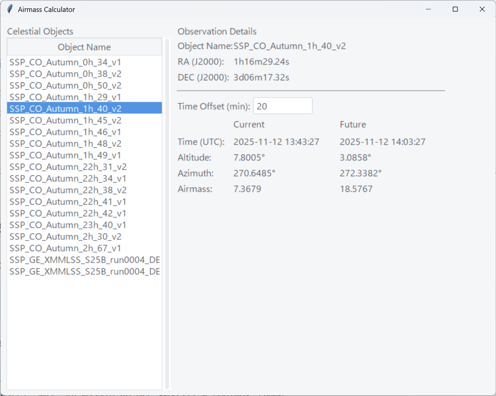

# Airmass Calculator

A simple GUI application to calculate and monitor the airmass of celestial objects. This tool is designed for astronomers to quickly check the current and future visibility of their targets from a given `.ope` file.

 
*(Note: You can replace `screenshot.png` with an actual screenshot of the application.)*

## Features

-   **Parses `.ope` files**: Loads celestial object coordinates from a standard `.ope` schedule file.
-   **Real-time Calculations**: Displays the current Altitude, Azimuth, and Airmass for a selected object, updating every second.
-   **Future Projections**: Calculates the same metrics for a future time, based on a user-configurable time offset.
-   **Modern UI**: Built with Python's `tkinter`, `ttk`, and the `ttkthemes` library for a clean and modern look.
-   **Location-Specific**: Calculations are based on a pre-configured observatory location (defaults to Mauna Kea).

## Requirements

-   Python 3.x
-   Astropy
-   ttkthemes

## Installation

1.  **Clone the repository:**
    ```bash
    git clone https://github.com/yasudank/airmassCalc.git
    cd airmassCalc
    ```

2.  **Install the required packages:**
    ```bash
    pip install astropy ttkthemes
    ```

## Usage

1.  **Run the application** from your terminal. You can specify the path to your `.ope` file using the `--ope` argument.

    ```bash
    python airmass_gui.py --ope /path/to/your/2025-11-12.ope
    ```

2.  If you don't provide an `.ope` file, the application will attempt to load `2025-11-12.ope` from the same directory by default.

3.  **Using the GUI:**
    -   A list of celestial objects from the `.ope` file will appear on the left.
    -   Click on an object to select it.
    -   The details for the selected object will appear on the right, showing its coordinates, current observational data, and future observational data.
    -   You can change the `Time Offset (min)` value to adjust the future projection time. The calculations will update automatically.

## `.ope` File Format

The application expects the `.ope` file to contain lines in the following format for each celestial object:

```
<key>=OBJECT="<object_name>" RA=<ra> DEC=<dec> EQUINOX=...
```

Example:
```
T01=OBJECT="M31" RA=004244.33 DEC=+411607.5 EQUINOX=J2000
T02=OBJECT="M42" RA=053516.46 DEC=-052322.8 EQUINOX=J2000
```
